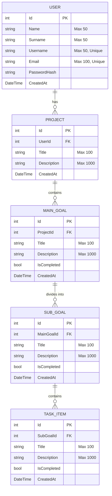

# 📋 TaskManagerApp

`TaskManagerApp` is a modern, high-performance web application designed for hierarchical task management and goal tracking. It is built on **ASP.NET Core 10.0 MVC** and features a responsive, Single-Page Application (SPA) style user interface driven by client-side AJAX requests communicating with a robust backend REST API.

The project features a sleek, dark-themed dashboard that allows users to register, log in, create nested projects, track goals, manage subgoals, and execute checkable tasks with real-time progress calculations propagating up the hierarchy.

---

## 🚀 Key Features

*   **👥 Cookie-Based Authentication:** Secure register, login, and logout functionalities with password hashing utilizing ASP.NET Core identity security helpers ([AccountController.cs](file:///C:/Users/ugur/source/repos/TaskManagerApp/TaskManagerApp/Controllers/AccountController.cs)).
*   **💻 Single-Page Interface:** Main application workspace operates as an interactive SPA within [Index.cshtml](file:///C:/Users/ugur/source/repos/TaskManagerApp/TaskManagerApp/Views/Home/Index.cshtml).
*   **🌳 Hierarchical Goal Tracking:** Organizes work into four distinct tiers:
    $$\text{User} \longrightarrow \text{Projects} \longrightarrow \text{Main Goals} \longrightarrow \text{Sub-Goals} \longrightarrow \text{Tasks}$$
*   **📈 Real-time Progress Rollups:** Progress percentages automatically propagate upward:
    *   *Sub-Goal Progress* = Percentage of completed tasks under the sub-goal.
    *   *Main Goal Progress* = Average progress of all sub-goals under the main goal.
    *   *Project Progress* = Average progress of all main goals under the project.
*   **🔍 Interactive Sidebar Tree with Search:** Instant client-side filtering of projects, main goals, and subgoals. Nodes can be collapsed/expanded individually.
*   **⚙️ Edit & Delete Mode:** A toggleable editing interface inside the sidebar allowing fast, direct deletions of projects, goals, and tasks.
*   **💾 Database Auto-Seeding:** Automatically verifies, applies schema migrations at startup, and generates a default user (`upur` with password `password123`) if none exists.

---

## 🛠️ Architecture & Tech Stack

*   **Backend Framework:** ASP.NET Core 10.0 (Web Sdk) targeting [.NET 10](file:///C:/Users/ugur/source/repos/TaskManagerApp/TaskManagerApp/TaskManagerApp.csproj).
*   **Database ORM:** Entity Framework Core 10.0 (using SQL Server LocalDB).
*   **Authentication:** ASP.NET Core `CookieAuthentication` middleware configured in [Program.cs](file:///C:/Users/ugur/source/repos/TaskManagerApp/TaskManagerApp/Program.cs).
*   **Frontend UI:** Vanilla HTML5, CSS3, and JavaScript (ES6+ fetch API, asynchronous rendering, transitions).
*   **Styling System:** Modern dark mode aesthetic leveraging CSS variables, glassmorphic effects, Outfit typography, and custom micro-animations configured in [site.css](file:///C:/Users/ugur/source/repos/TaskManagerApp/TaskManagerApp/wwwroot/css/site.css).

---

## 🗄️ Database Schema & Relationships

The database consists of five tables managed via Entity Framework Core. Cascade delete rules are configured so that deleting a parent entity automatically deletes all child elements (e.g., deleting a Project deletes all its Main Goals, Sub-Goals, and Tasks).



---

## 📂 Directory & File Structure

Here is a breakdown of the primary workspace files and directories:

*   **📂 TaskManagerApp**
    *   **📂 Controllers**
        *   [DashboardApiController.cs](file:///C:/Users/ugur/source/repos/TaskManagerApp/TaskManagerApp/Controllers/DashboardApiController.cs) - The central controller handling REST requests, tree structures, details, and CRUD operations for Projects, MainGoals, SubGoals, and Tasks.
        *   [AccountController.cs](file:///C:/Users/ugur/source/repos/TaskManagerApp/TaskManagerApp/Controllers/AccountController.cs) - Manages cookie authentication, logins, user registrations, password validations, and logout actions.
        *   [HomeController.cs](file:///C:/Users/ugur/source/repos/TaskManagerApp/TaskManagerApp/Controllers/HomeController.cs) - Serves the authenticated views, routing to the main Dashboard view.
        *   *Legacy/Fallback Controllers:* Contains auxiliary MVC controllers including [ProjectController.cs](file:///C:/Users/ugur/source/repos/TaskManagerApp/TaskManagerApp/Controllers/ProjectController.cs), [MainGoalController.cs](file:///C:/Users/ugur/source/repos/TaskManagerApp/TaskManagerApp/Controllers/MainGoalController.cs), [SubGoalController.cs](file:///C:/Users/ugur/source/repos/TaskManagerApp/TaskManagerApp/Controllers/SubGoalController.cs), and [TaskItemController.cs](file:///C:/Users/ugur/source/repos/TaskManagerApp/TaskManagerApp/Controllers/TaskItemController.cs).
    *   **📂 Models**
        *   [AppDbContext.cs](file:///C:/Users/ugur/source/repos/TaskManagerApp/TaskManagerApp/Models/AppDbContext.cs) - Specifies DbSets and model relationships (such as cascade deletions).
        *   [User.cs](file:///C:/Users/ugur/source/repos/TaskManagerApp/TaskManagerApp/Models/User.cs) - Entity representation for users.
        *   [Project.cs](file:///C:/Users/ugur/source/repos/TaskManagerApp/TaskManagerApp/Models/Project.cs) - Entity representation for workspace projects.
        *   [MainGoal.cs](file:///C:/Users/ugur/source/repos/TaskManagerApp/TaskManagerApp/Models/MainGoal.cs) - Entity representation for primary goals.
        *   [SubGoal.cs](file:///C:/Users/ugur/source/repos/TaskManagerApp/TaskManagerApp/Models/SubGoal.cs) - Entity representation for secondary sub-objectives.
        *   [TaskItem.cs](file:///C:/Users/ugur/source/repos/TaskManagerApp/TaskManagerApp/Models/TaskItem.cs) - Entity representation for single actionable tasks.
    *   **📂 Views**
        *   **📂 Account**
            *   [Login.cshtml](file:///C:/Users/ugur/source/repos/TaskManagerApp/TaskManagerApp/Views/Account/Login.cshtml) - Login form page with input validation.
            *   [Register.cshtml](file:///C:/Users/ugur/source/repos/TaskManagerApp/TaskManagerApp/Views/Account/Register.cshtml) - New user sign-up page.
        *   **📂 Home**
            *   [Index.cshtml](file:///C:/Users/ugur/source/repos/TaskManagerApp/TaskManagerApp/Views/Home/Index.cshtml) - The main Single-Page dashboard containing HTML structures for stat cards, detail layouts, modals for CRUD, and the JS Engine.
        *   **📂 Shared**
            *   [_Layout.cshtml](file:///C:/Users/ugur/source/repos/TaskManagerApp/TaskManagerApp/Views/Shared/_Layout.cshtml) - Application shell layout defining the collapsible sidebar, top navigation, search input, and viewport wrappers.
    *   **📂 wwwroot**
        *   **📂 css**
            *   [site.css](file:///C:/Users/ugur/source/repos/TaskManagerApp/TaskManagerApp/wwwroot/css/site.css) - Main stylesheet defining CSS Custom Properties, layout resets, customized grid patterns, animations, and card transformations.
    *   [Program.cs](file:///C:/Users/ugur/source/repos/TaskManagerApp/TaskManagerApp/Program.cs) - Application bootstrap configuring builder services, DI injections, auth filters, middleware routing pipelines, and database seed logic.
    *   [appsettings.json](file:///C:/Users/ugur/source/repos/TaskManagerApp/TaskManagerApp/appsettings.json) - Stores global application connection strings and configuration settings.
    *   [TaskManagerApp.csproj](file:///C:/Users/ugur/source/repos/TaskManagerApp/TaskManagerApp/TaskManagerApp.csproj) - Package reference settings, Framework target configurations.

---

## 🚦 REST API Endpoints Overview

The application features a RESTful API endpoints tree exposed via [DashboardApiController.cs](file:///C:/Users/ugur/source/repos/TaskManagerApp/TaskManagerApp/Controllers/DashboardApiController.cs):

| Method | Endpoint | Description | Auth Required |
|---|---|---|---|
| **GET** | `/api/dashboard/tree` | Returns the entire hierarchical projects tree structure for sidebar rendering. | Yes |
| **GET** | `/api/dashboard/project/{id}` | Fetches full, detailed information for a single project including goals and subgoals. | Yes |
| **POST** | `/api/dashboard/project` | Creates a new Project workspace. | Yes |
| **PUT** | `/api/dashboard/project/{id}` | Edits an existing Project's details. | Yes |
| **DELETE**| `/api/dashboard/project/{id}` | Deletes a project and all associated elements cascadingly. | Yes |
| **POST** | `/api/dashboard/maingoal` | Adds a new Main Goal to a specific project. | Yes |
| **PUT** | `/api/dashboard/maingoal/{id}` | Updates details of a Main Goal. | Yes |
| **DELETE**| `/api/dashboard/maingoal/{id}` | Deletes a Main Goal. | Yes |
| **POST** | `/api/dashboard/maingoal/{id}/toggle`| Toggles the completion status of a Main Goal. | Yes |
| **POST** | `/api/dashboard/subgoal` | Adds a Sub Goal to a Main Goal. | Yes |
| **PUT** | `/api/dashboard/subgoal/{id}` | Updates details of a Sub Goal. | Yes |
| **DELETE**| `/api/dashboard/subgoal/{id}` | Deletes a Sub Goal. | Yes |
| **POST** | `/api/dashboard/subgoal/{id}/toggle`| Toggles the completion status of a Sub Goal. | Yes |
| **POST** | `/api/dashboard/task` | Adds an actionable Task to a Sub Goal. | Yes |
| **PUT** | `/api/dashboard/task/{id}` | Updates details of a Task. | Yes |
| **DELETE**| `/api/dashboard/task/{id}` | Deletes a Task. | Yes |
| **POST** | `/api/dashboard/task/{id}/toggle`| Toggles the completion status of a Task. | Yes |

---

## 🚀 Getting Started & Local Setup

Follow these instructions to run the project on your local machine:

### 📋 Prerequisites
1. **.NET 10 SDK** installed.
2. **SQL Server LocalDB** or a regular SQL Server instance running locally.

### 💾 1. Configure the Connection String
Verify the database connection string in the configuration file [appsettings.json](file:///C:/Users/ugur/source/repos/TaskManagerApp/TaskManagerApp/appsettings.json):
```json
"ConnectionStrings": {
  "DefaultConnection": "Server=(localdb)\\mssqllocaldb;Database=TaskManagerDb;Trusted_Connection=True;MultipleActiveResultSets=true"
}
```
> [!NOTE]
> If you are using a full SQL Server instance, replace the `Server` address and credential options accordingly.

### 🛠️ 2. Running migrations and starting the host
Navigate to the project root directory and start the application. Entity Framework migrations and initial seed configurations will automatically run upon startup.

```powershell
# Navigate to project file folder
cd TaskManagerApp

# Run the app locally
dotnet run
```
After executing, the terminal will output the local port (e.g. `https://localhost:5001` or `http://localhost:5000`). Open your browser of choice and browse to that location.

### 👤 3. Seeded Login Credentials
To help you explore the application immediately without signing up, the system seeds a default admin account upon startup:

*   **Username:** `upur` (or Email: `ugur.guler@example.com`)
*   **Password:** `password123`
